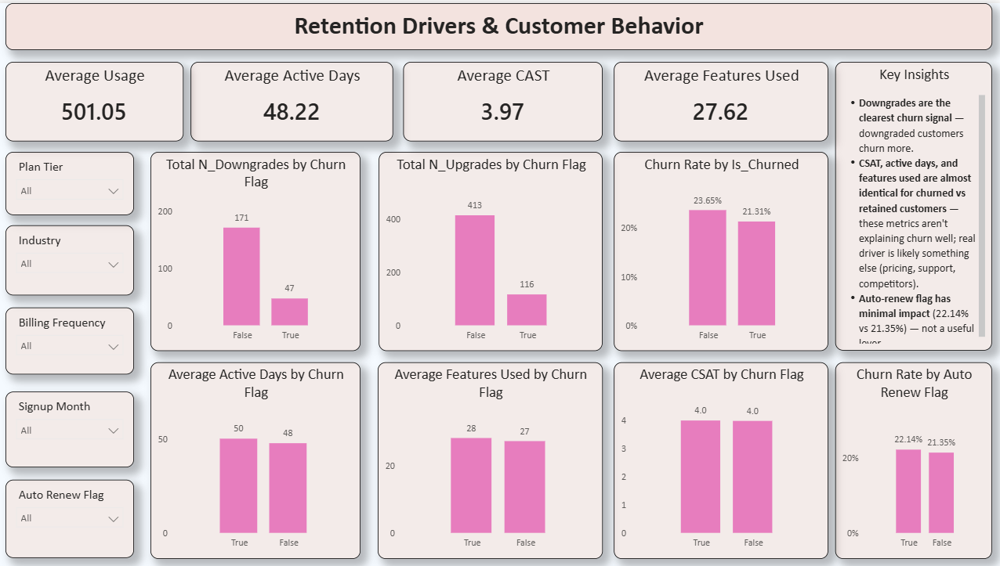

# RavenStack — Customer Retention & Churn Analysis

## Project Overview
This project analyzes customer churn and retention behavior for **RavenStack**, a SaaS/subscription business, using real-world style customer and subscription data. The goal is to help business, product, and growth teams understand:

- Why customers are leaving the platform
- Which customer segments are most likely to churn
- How long customers typically stay active
- What actions can improve customer retention

The end-to-end workflow covers **data cleaning (Python) → data merging → Power BI dashboarding → business insights**.

---

## Data Sources

Five raw datasets were provided and used as the foundation for this analysis:

| File Name | Description |
|---|---|
| `ravenstack_accounts` | Core customer/account information (customer ID, industry, country, plan tier, signup date, etc.) |
| `ravenstack_subscriptions` | Subscription details — plan tier, billing frequency, auto-renew flag, MRR |
| `ravenstack_churn_events` | Churn records — churn date, churn reason, is_churned flag |
| `ravenstack_feature_usage` | Product engagement data — features used, active days, usage volume |
| `ravenstack_support_tickets` | Customer support interactions — ticket counts, CSAT scores |

---

## Data Pipeline

### 1. Data Cleaning (Python)
Each of the five raw files was cleaned individually before merging:
- Removed duplicate records
- Handled missing/null values
- Standardized date formats (signup date, churn date)
- Standardized categorical values (e.g., country, industry, plan tier naming consistency)
- Validated data types (numeric fields, flags, dates)

### 2. Data Merging
All five cleaned datasets were merged into a single unified table — **`df_master`** — using `customer_id` as the common key, joining:

`accounts` → `subscriptions` → `churn_events` → `feature_usage` → `support_tickets`

This master table became the single source of truth for all downstream analysis and dashboarding.

### 3. Import into Power BI
`df_master` was imported into Power BI to build interactive, filterable dashboards for business stakeholders.

---

## Dashboards Built

### 📊 Dashboard 1: SaaS Customer Churn & Retention Overview
- Total Customers, Total MRR, Total Tickets, Retained vs Churned Customers, Churn Rate
- Monthly Churn Trend
- Top Churn Reasons
- Churn Rate by Plan Tier
- Churn Rate by Billing Frequency

  # 🖥️ Dashboard Preview

### 📊 Dashboard 2: Customer Retention & Cohort Analysis
- Churn Rate by Signup Month (cohort trend)
- Churn Rate by Industry
- Churn Rate by Referral Source
- Churn Rate by Country
- Filters: Signup Month, Plan Tier, Country, Referral Source, Industry

  # 🖥️ Dashboard Preview

### 📊 Dashboard 3: Retention Drivers & Customer Behavior
- Average Usage, Active Days, CSAT, Features Used
- Upgrades/Downgrades by Churn Flag
- Active Days / Features Used / CSAT by Churn Flag
- Churn Rate by Auto-Renew Flag
- Filters: Plan Tier, Industry, Billing Frequency, Signup Month, Auto Renew Flag

# 🖥️ Dashboard Preview

---

## Key Metrics

| Metric | Value |
|---|---|
| Total Customers | 500 |
| Total MRR | $1M |
| Total Support Tickets | 2K |
| Retained Customers | 390 |
| Churned Customers | 110 |
| **Overall Churn Rate** | **22.00%** |
| Lifetime Median | 3.91 |
| Reactivated Customers | 55 |
| Average Usage | 501.05 |
| Average Active Days | 48.22 |
| Average CSAT | 3.97 |
| Average Features Used | 27.62 |

---

## Key Insights

1. **Churn rate is high at 22%**, above typical healthy SaaS benchmarks — needs a focused retention strategy.
2. **March shows a sharp churn spike** (35 customers) compared to other months — worth root-cause investigation.
3. **Geography matters** — Germany has the highest churn (32%), Australia the lowest (12.5%).
4. **Industry matters** — DevTools customers churn the most (30.97%), EdTech/Cybersecurity the least (~16%).
5. **Referral source matters** — Event-referred customers churn the most (30.21%), Partner-referred customers churn the least (14.61%).
6. **Signup cohorts in February and September churn more**, suggesting seasonal or promotional signup quality issues.
7. **Downgrades are linked to churn** — customers who downgrade are more likely to churn.
8. **Standard engagement metrics (CSAT, active days, features used) are nearly identical between churned and retained customers** — these alone don't explain churn well; pricing, budget, and support-related factors (from Top Churn Reasons) appear more influential.
9. **Auto-renew status has minimal impact** on churn rate (22.14% vs 21.35%).

---

## Recommended Next Steps
- Investigate the March churn spike (campaign, pricing change, or outage?)
- Address top churn reasons: pricing and budget concerns
- Strengthen partner referral channel given its lower churn rate
- Review onboarding/signup quality for February and September cohorts
- Use downgrade activity as an early-warning churn signal
- Explore additional data (support ticket sentiment, competitor mentions, pricing tier history) since usage/CSAT alone don't differentiate churned vs. retained customers

---

## Tech Stack
- **Python** (pandas) — data cleaning, transformation, and merging
- **Power BI** — dashboarding and interactive visualization

---

*This project simulates real analytics work performed by data analysts on product, growth, and retention teams at SaaS companies.*
